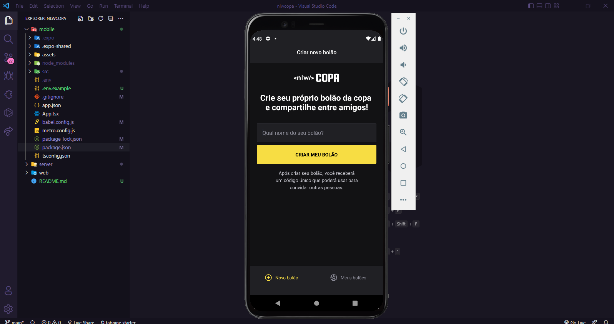
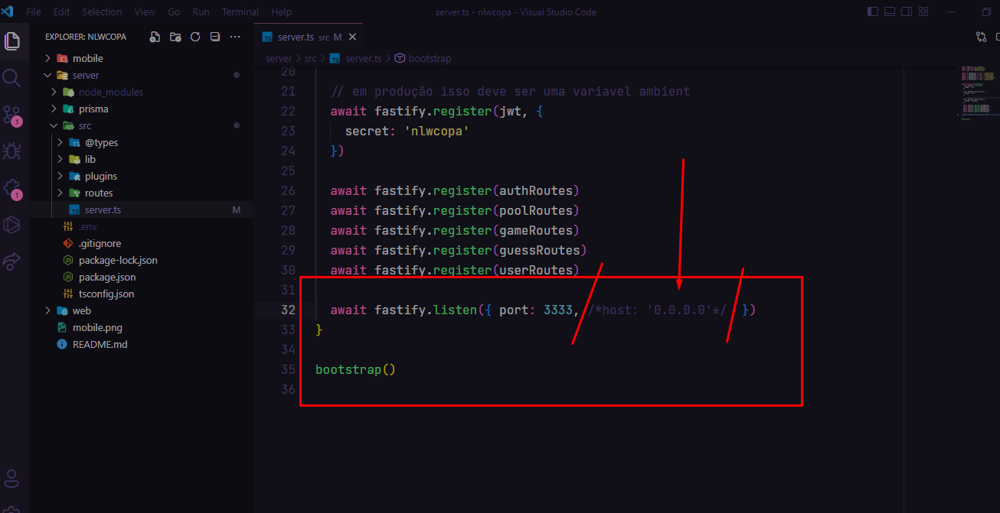

## NLW COPA

<h1 align="center">Projeto NLW Copa</h1>

  <a href="#-tecnologies">Technologies</a>&nbsp;&nbsp;&nbsp;|&nbsp;&nbsp;&nbsp;
  <a href="#-project">Project</a>&nbsp;&nbsp;&nbsp;|&nbsp;&nbsp;&nbsp;
  <a href="#-layout">Layout</a>&nbsp;&nbsp;&nbsp;|&nbsp;&nbsp;&nbsp;
  <a href="#-license">License</a>

## 🚀 Technologies

This project was developed with the following technologies:

# Backend
- [Mermaid](https://mermaid-js.github.io/mermaid/#/)
- [Prisma](https://www.prisma.io/)
- [fastify](https://www.fastify.io/)
- [Short Unique ID](https://shortunique.id/)
- [Zod](https://zod.dev/)
- [Typescript](https://www.typescriptlang.org/)
- [JWT](https://jwt.io/)

# Frondend
- [Next](https://nextjs.org/)
- [Axios](https://axios-http.com/ptbr/)
- [React](https://pt-br.reactjs.org/)
- [tailwindcss](https://tailwindcss.com/)
- [Typescript](https://www.typescriptlang.org/)

# Mobile
- [Expo](https://expo.dev/)
- [React Native](https://reactnative.dev/)
- [phosphor-react-native](https://www.npmjs.com/package/phosphor-react-native)
- [Day.js](https://day.js.org/)

## 🚀 Project 
  
Project to create a pool based on the world cup games.
  Play between friends.

  
Author: André de Souza

  
Project carried out at NLW

- [Rockeseat](https://www.rocketseat.com.br)

## 🚀 Layout

  

  When running the project on the web, be careful to turn off the host: '0.0.0.0' on the server.
  This feature is mobile only. See print:
  

## 🚀 License   
    
  
